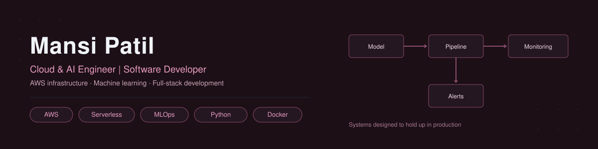

  

 

### 🧭 About me

Hi, I'm Mansi — a Master of Applied Computer Science student at Dalhousie University, Halifax, working at the intersection of cloud infrastructure, AI/ML, and software development. I like the layer of engineering that sits between "a model works" and "a system runs reliably in production" — serverless pipelines, deployment automation, and the kind of infrastructure that keeps things running after the demo ends.

- 🎓 MACS student at Dalhousie University, Halifax, NS
- 🌍 International student, open to co-op opportunities across Canada
- 🧠 Came to ML/AI by way of a cybersecurity & forensics background — still shapes how I think about reliability and failure modes

### 🎯 Current focus

- 🏗️ Building serverless, event-driven cloud systems — monitoring, drift detection, and deployment pipelines with full IaC and CI/CD
- 🧩 Strengthening data structures & algorithms for technical interviews
- 🤝 Open to co-op opportunities in **Cloud Engineering**, **AI/ML**, and **Software Development**

### 🛠️ Tech stack

### 📊 GitHub stats

  

 

  
  

  

### 🚀 Featured projects

**🔍 [ML Model Monitoring Pipeline](https://github.com/MansiPatil21/driftwatch-ml-cloud)**
Serverless, event-driven AWS pipeline that monitors ML model predictions in real time, detects confidence drift and anomalies, and automatically triggers alerts. Built with 9 Lambda functions, API Gateway, DynamoDB, Kinesis, Step Functions, S3, SNS, CloudWatch, and EventBridge — full CloudFormation IaC and GitHub Actions CI/CD.

**🤖 [GenAI Chatbot — Unimind Cognition Internship](https://github.com/MansiPatil21/Gen-AI-UNIMIND-chatbot)**
Full-stack chatbot with a FastAPI backend and Streamlit frontend, backed by a MySQL database for response retrieval. Containerized with Docker and managed via Supervisord for concurrent, auto-restarting services.

**📰 Fake News Detection — Published Research (IEEE)**
Comparative study of SVM and Logistic Regression for fake news classification across two public datasets, with preprocessing via tokenization, stemming, and feature engineering. Extended as a final-year capstone with weekly dynamic model updating. [Read the paper →](https://ieeexplore.ieee.org/document/10842732)

### 🤝 Collaborative projects

**🔥 [Chain Reaction — CityFlow Simulator](https://github.com/harshapilli369/hack-the-elements-citylens)** *(team hackathon project — forked from teammate's repo)*
A disaster-cascade simulation platform for Atlantic Canada, built at Hack The Elements 2025. Contributed to frontend UI components, chart visualizations (Recharts), FastAPI backend endpoints, and Docker deployment setup as part of a 4-person team.

 

  

